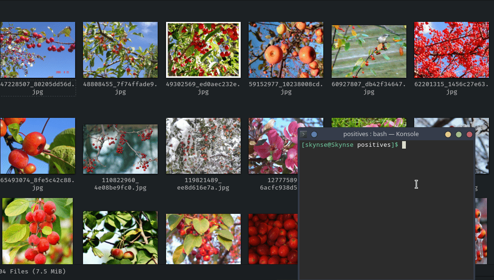

# Stashit

Simple tool that moves files to datetime based folder depending on where the script was run



## Installation
Linux
>`sudo python3 setup.py install`

Windows

> `py setup.py install`
## Usage
Type ```stashit``` in the terminal and watch all your files get stashed
don't worry, you can simply go into the folder and move them all out manually if
the change was undesired

## Making Changes

After testing, don't forget to run the clean script to remove the files that setuptools creates before commiting to the repo.
