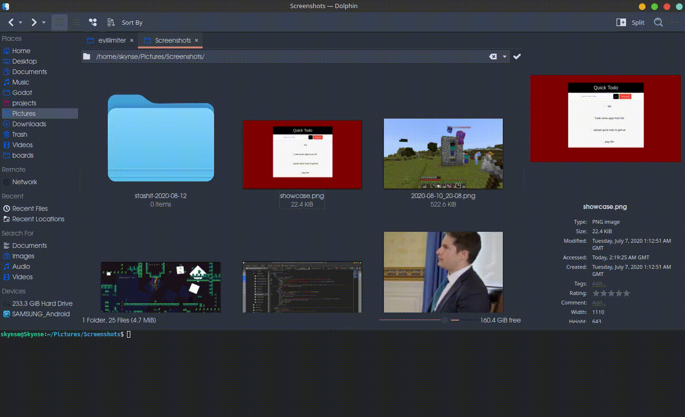

# Stashit

Simple tool that moves files to datetime based folder depending on where the script was run



## Usage
Type ```stashit``` in the terminal and watch all your files get stashed
don't worry, you can simply go into the folder and move them all out manually if
the change was undesired
